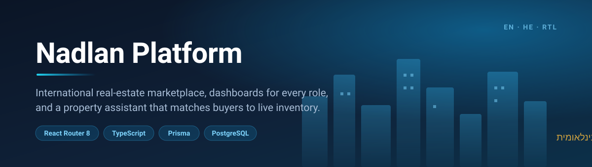
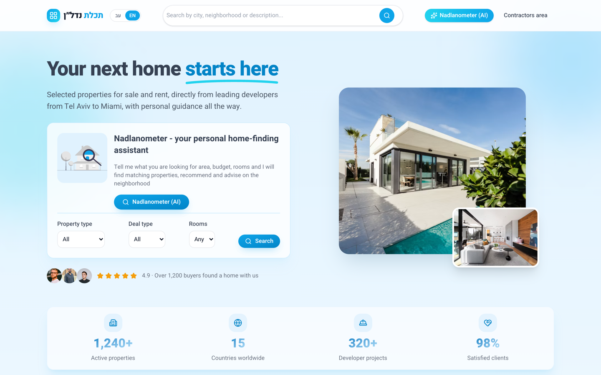
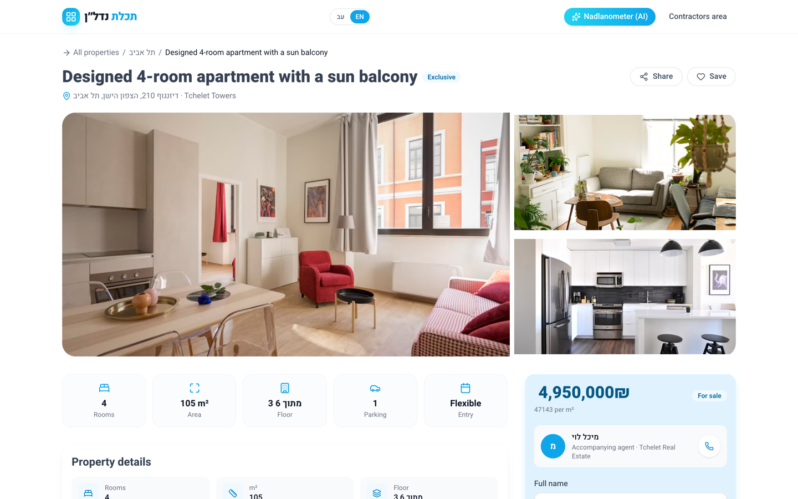
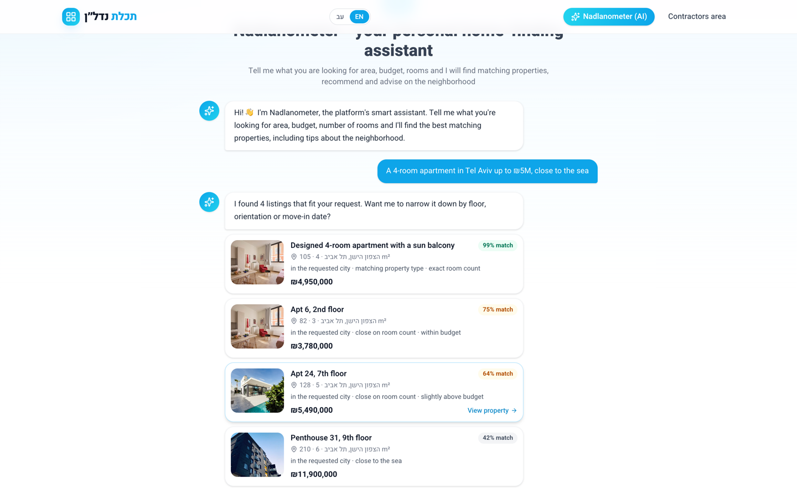
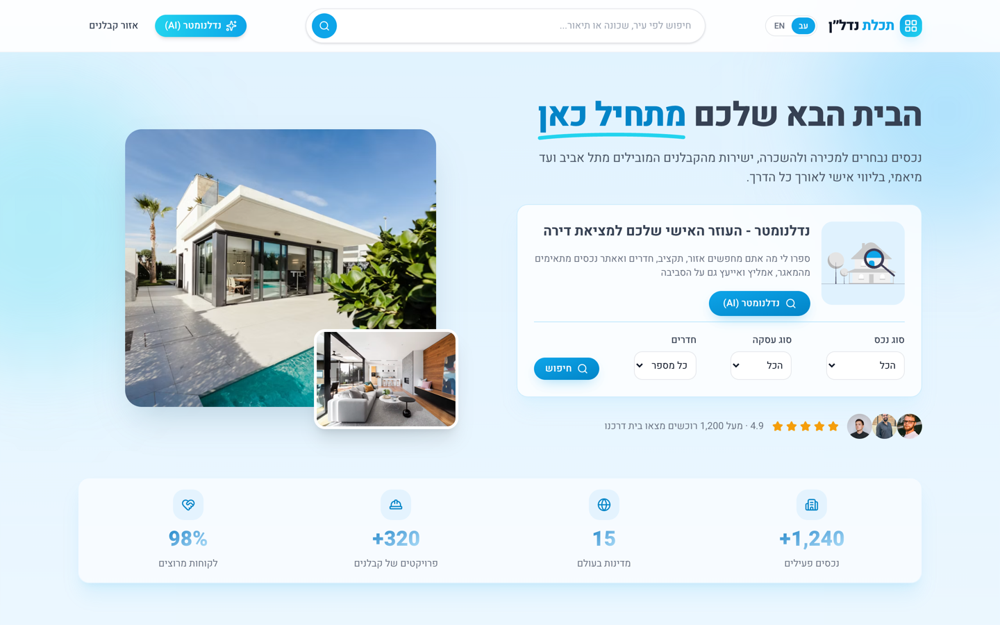
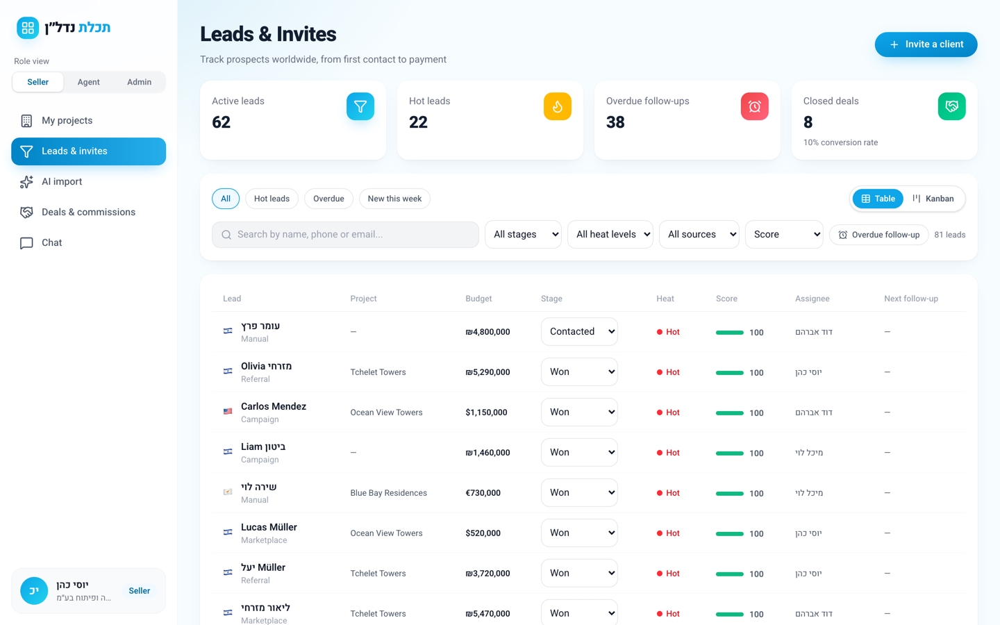
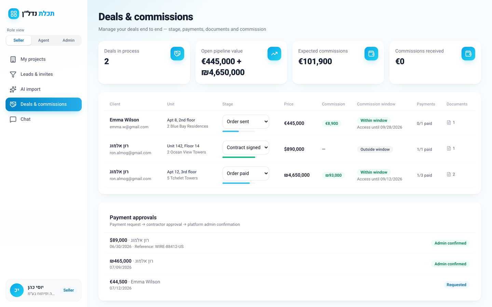
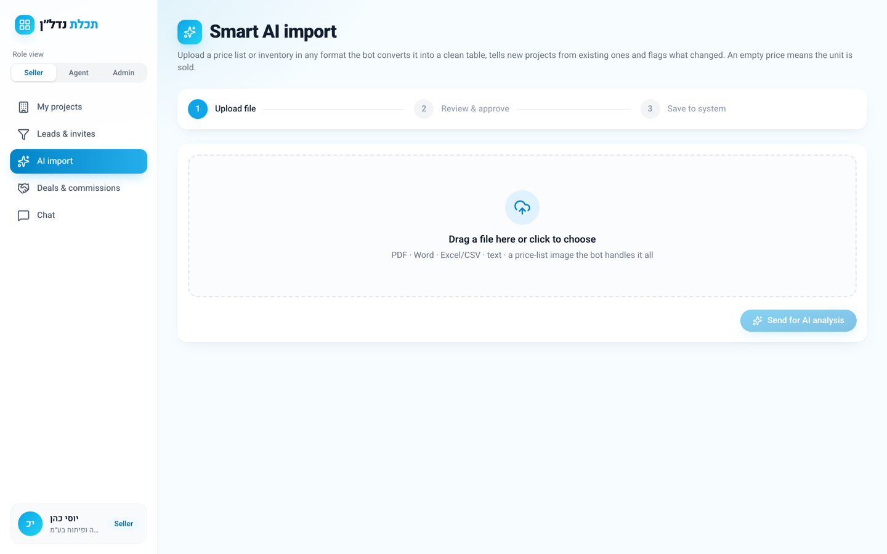
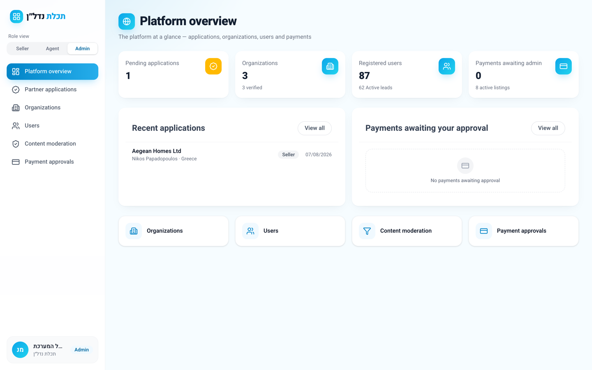

<p align="center">
  
</p>

<p align="center">
  
  
  
  
  
  
  
</p>

## The product

A new apartment changes hands through four different people, and each of them needs a
different screen.

**Nadlan Platform** puts all four in one system. A **contractor** uploads a price list and
their inventory appears on the marketplace. A **buyer** searches it in English or Hebrew,
or just describes what they want and lets the assistant do the matching. An **agent**
picks up the lead, runs it through the pipeline, schedules the viewing and closes the deal
with a payment schedule attached. An **admin** approves the organisation, moderates the
listing and confirms the money.

Every screen is bilingual English / Hebrew with a full RTL flip, because the buyer and the
contractor are rarely reading in the same language.

---

## What's inside

### 🏙️ Public marketplace

Free-text search across cities, neighbourhoods and property names, with filters for
country, category, deal type and room count. Up to four properties can be pinned into a
side-by-side comparison. Each property page carries a gallery, the project it belongs to,
its remaining units, similar listings, and a contact form that opens a real lead in the
agent's pipeline — a repeat enquiry from the same person attaches to the existing lead
instead of creating a duplicate.

### 🤖 Nadlanometer — the property assistant

A conversation instead of a filter bar. The visitor writes _"a 4-room apartment in Tel Aviv
up to ₪5M"_ or _"penthouse with a sea view in Larnaca"_, and gets ranked recommendation
cards with a match score and a concrete reason for each one — drawn from the live
inventory, never invented.

It answers in the language the visitor wrote in, and it **runs with or without an AI API
key**: with a key, Claude reads the inventory and replies conversationally; without one, a
built-in matching engine parses budget, city, rooms, size, deal type, category and
amenities out of the message, scores the inventory and answers on its own. The UI says
which mode produced the answer.

### 💼 Agent & seller workspace

The lead pipeline with stages, heat, next follow-up and a full activity log — every stage
change is written to the log with who moved it and why. Alongside it: a viewings schedule,
a deal board with payment milestones and commissions, a personal portfolio, and a
publishing form that pushes a contractor unit or a private listing to the marketplace.

### 🏗️ Contractor inventory & smart import

Projects, units, reservations and price history. The import screen takes a price list and
returns a reviewable diff: which units are **new**, which **changed price**, and which were
**sold** — each row editable before anything is written to the database.

With an AI key it reads PDFs, DOCX, images and spreadsheets in any language. Without one it
parses CSV / TSV / JSON locally, recognising Hebrew and English column headers, currency
symbols per project, and "sold" markers. Sample files live in
[`docs/samples`](docs/samples). In both paths the _classification itself_ is computed
deterministically against the database — the model is never trusted to decide what counts
as sold.

### 🛡️ Admin portal

Organisations and partner applications, user management, listing moderation, and a
two-stage payment approval flow: the contractor approves, the admin confirms, and the
matching milestone in the deal is marked paid.

### 💬 Chat

Conversations between clients, agents and contractors, with per-participant read state —
"read" is derived from where each participant's last-read message sits in the thread, so it
stays correct in group conversations — and messages that can link to a specific property or
deal.

---

## Screenshots

|                                                                                               |                                                                             |
| :-------------------------------------------------------------------------------------------: | :-------------------------------------------------------------------------: |
|                                   |                |
|           **Marketplace** — hero search, filters and inventory from three countries           | **Property page** — gallery, project context, similar units and a lead form |
|                        |             |
| **Nadlanometer** — ranked matches with a reason per card, here answered by the offline engine |          **Same page in Hebrew** — the whole layout mirrors to RTL          |
|                                     |           |
|            **Lead pipeline** — stages, heat, score and follow-ups, table or kanban            |          **Deals** — milestones, commissions and payment approvals          |
|                                     |                    |
|         **Smart import** — a price list becomes a reviewable diff before it is saved          |    **Admin portal** — organisations, moderation and payment confirmation    |

---

## Engineering highlights

**One domain model, two languages.** Every human-facing string in the model is
`Localized<T> = Record<'he' | 'en', T>`, so a locale switch is a lookup rather than a
parallel content tree. The active locale is read from a cookie during SSR, which means the
first paint is already in the right language and the right direction — no flash of Latin
text on a Hebrew page.

**A real boundary between routes and the database.** Pages never touch Prisma. They call
functions in `app/server/`, which query Postgres and map rows into the domain types in
`app/types/`. When the app moved from in-memory demo data to Postgres, only that one layer
changed — the routes were untouched.

**Deterministic decisions stay deterministic.** The import pipeline uses AI for the part
that genuinely needs language understanding (reading an arbitrary price list) and plain
code for the part that must be right (comparing it against the database and classifying
each unit). Getting that split wrong is how import features quietly corrupt inventory.

**Graceful degradation as a design rule.** Both AI features have a complete non-AI path,
so the project runs — and demos — with no API key, no credits and no network calls to a
paid service.

**A design system rather than page-by-page styling.** `app/components/ui` holds the
buttons, cards, badges, drawers, modals, forms, pagination and motion presets the whole app
is built from, on a Tailwind v4 token palette.

---

## Tech stack

React Router v8 (framework mode, SSR) · React 19 · TypeScript · Tailwind CSS v4 ·
Prisma 7 · PostgreSQL · Motion · Swiper · Lucide · Anthropic SDK (optional) · Docker

<details>
<summary><b>Run it locally</b></summary>

Requires Node.js 22.22+ and a PostgreSQL database.

```bash
npm install
cp .env.example .env     # set DATABASE_URL / DIRECT_URL
npm run db:migrate       # create the schema
npm run db:seed          # load the demo inventory, leads, deals and chats
npm run dev              # http://localhost:5173
```

The seed data lives in `app/data/` — projects in Tel Aviv, Larnaca and Miami, plus users,
leads, viewings, deals and conversations, so every dashboard has something to show.

| Script                                         | Purpose                     |
| ---------------------------------------------- | --------------------------- |
| `npm run dev`                                  | Development server with HMR |
| `npm run build` / `npm start`                  | Production build and serve  |
| `npm run typecheck`                            | Route typegen + `tsc`       |
| `npm run format`                               | Prettier over the repo      |
| `npm run db:migrate` / `db:seed` / `db:studio` | Prisma workflows            |

The AI features are optional. Add `ANTHROPIC_API_KEY` to `.env` to enable the Claude path;
without it the assistant and the importer use their local engines.

```bash
docker build -t nadlan-platform .
docker run -p 3000:3000 --env-file .env nadlan-platform
```

</details>

<details>
<summary><b>Project structure</b></summary>

```
app/
├── routes/           public pages + dashboards (seller, contractor, admin)
├── server/           data access: Prisma queries, mappers, import, AI
├── assistant/        Nadlanometer — prompt, schema and offline matching engine
├── components/       design system (ui/) and shared blocks
├── data/             demo/seed data and domain metadata
├── types/            the domain model
├── i18n/             dictionary, locale provider, language switcher
└── listings/         marketplace list and cards
prisma/               schema, migrations and seed script
docs/                 functional spec and work plan (Hebrew), sample imports
```

</details>

---

<sub>Built as a full product exercise — schema, server layer, dashboards and design system.
Not operated as a live service. Functional spec: [`docs/spec.md`](docs/spec.md) ·
Work plan: [`docs/tasks.md`](docs/tasks.md) (both in Hebrew).</sub>

<sub>[MIT](LICENSE) © Idan Srur</sub>
